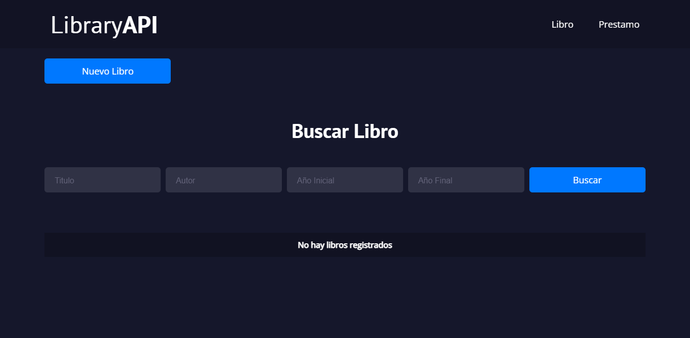
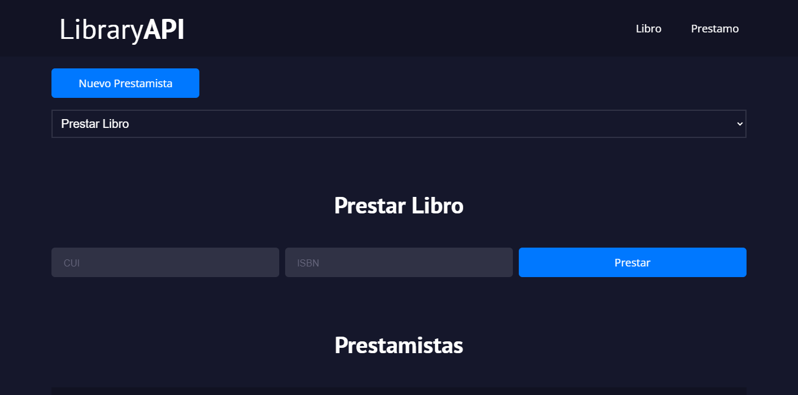

# Biblioteca
Consumiendo una API: [API Biblioteca](https://github.com/brandonT2002/ipc1-1s2022-proyecto2)

Sistema Web que permite la administración de una biblioteca. Registrando libros, prestamistas y guardando un historial de préstamos.
 
 
 

	<!-- (optional) center align -->
    
    

 
 
 

	<!-- (optional) center align -->
    
    

